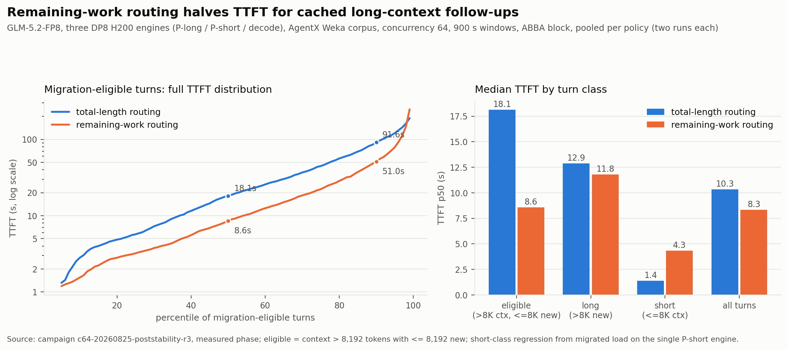

# Kermit GLM load-gated routing results

Deployment: `zai-org/GLM-5.2-FP8` on three DP8/TP1 engines (P-long work-range
`8193-120000`, P-short `0-8192`, decode with session-affinity sidecar), vLLM
`nightly-6f91edf9-pr50302`, EPP image `p2p-cache-routing-709e0991`, 64 GiB CPU
offload tier per rank, `MultiConnector` (NixlConnector + tiered
OffloadingConnector with p2p tier). Both router configurations run the
load-gated composition (`prefix-cache-affinity-filter` with
`peakPrefillThroughput: 3585`, `maxTTFTPenaltyMs: 3500`, affinity threshold
0.35, CPU tier weight 0.4; decode session affinity from `x-session-id` then
`x-correlation-id`, TTL 3600 s). The remaining-work configuration additionally
sets `reusableTokensProducerName: p2p-cache-source` so `context-length-aware`
routes on remaining prefill work; the total-length configuration routes on
full context length. Exact manifests: [engines](engines/),
[control-plane](control-plane/), workload harness: [workload](workload/).

## Accepted evidence

### Sustained C64 comparison, one counterbalanced block

Remaining-work routing cuts median TTFT for migration-eligible turns from
18.1 s to 8.6 s (-52.7%) and fleet-wide p90 TTFT from 69.7 s to 48.4 s
(-30.6%), while completing 6.8% more turns in the same measured window.

Campaign `c64-20260825-poststability-r3`: four runs in ABBA order
(total-length, remaining-work, remaining-work, total-length), each with a joint
engine restart, an EPP restart, a 120 s warmup, and a 900 s measured window
over the `semianalysis_cc_traces_weka_062126` corpus at concurrency 64, seed
`20260707`, `--cache-bust first-turn-prefix`. All four runs report
`valid: true` with zero request errors in any phase. Artifacts:
`/workload/p2p-context-migration-glm/c64-20260825-poststability-r3-b01-p0{1..4}-*`.

Turn classes use the per-conversation context delta: migration-eligible means
total context above 8,192 tokens with at most 8,192 new tokens; long-delta
means both above 8,192; short means total at or below 8,192. TTFT in seconds,
measured phase only.

| Run (block order) | Measured turns | All p50 / p90 | Eligible p50 / p90 (n) | Long p50 | Short p50 (n) | P-short external-hit tokens |
| --- | ---: | ---: | ---: | ---: | ---: | ---: |
| Total-length routing (opening) | 1,730 | 9.96 / 69.78 | 16.55 / 87.50 (862) | 11.65 | 1.18 (360) | 10,688 |
| Remaining-work routing, first | 1,753 | 8.93 / 54.72 | 9.75 / 58.66 (902) | 12.75 | 3.74 (360) | 42,220,608 |
| Remaining-work routing, second | 1,821 | 7.66 / 44.69 | 7.05 / 45.53 (959) | 11.07 | 5.58 (355) | 44,088,704 |
| Total-length routing (closing) | 1,618 | 10.83 / 69.24 | 19.91 / 94.49 (784) | 14.28 | 1.69 (360) | 31,424 |

Position-matched pairs:

- Opening pair: eligible p50 16.55 s to 9.75 s (-41.1%); all-turns p50 -10.4%,
  p90 -21.6%.
- Closing pair: eligible p50 19.91 s to 7.05 s (-64.6%); all-turns p50 -29.2%,
  p90 -35.5%.
- Pooled distributions (both runs per policy): eligible p50 18.1 s to 8.6 s
  (-52.7%, 2.11x), eligible p90 91.6 s to 51.0 s (-44.3%); all-turns p50
  10.3 s to 8.3 s (-19.3%), p90 69.7 s to 48.4 s (-30.6%).

Mechanism evidence: P-short served 42.2M and 44.1M externally transferred
prefix tokens in the remaining-work routing runs against 10,688 and 31,424 under
total-length routing - three orders of magnitude, entirely policy-driven. The
predicted-delay gate opened 832 and 543 times in the two remaining-work routing windows
(`TTFT load gate broken` in the streamed EPP logs). Decode session affinity
bound 261 and 262 sessions per run, matching the distinct
`x-correlation-id` counts. The remaining-work routing runs also completed more measured
turns in the same window (1,787 mean vs 1,674, +6.8%).

Identified tradeoff: turns with short total context regress from 1.18-1.69 s
p50 to 3.74-5.58 s p50 because migrated follow-ups occupy the single P-short
engine and native short requests queue behind them. Fleet-wide latency still
improves at every percentile reported above. P-short capacity sizing, or load
spreading across multiple P-short replicas, is the follow-up.

Caveats: one block, and the fixed corpus seed makes each run's request
sequence identical, so within-policy differences between positions are
environmental (pod placement rotates across joint restarts). Both pairs agree
in sign and magnitude class; multi-block confidence intervals require
`BLOCKS=5`.

### Workload pattern fit

From the same corpus's per-turn data (1,406 measured turns, 184
conversations in an earlier total-length run): 48-50% of turns are
migration-eligible, 27-28% long-delta, 23-24% short-total; median per-turn
delta is about 2K tokens on a 37K-token median context; sessions run 3-42
turns. The eligible share is flat (43.8-49.6%) for boundaries swept from
2,048 to 24,576, so classification does not depend on fine boundary tuning.
Maximum observed context is 109,895 tokens against the 120,000 ceiling.

### Idle session control

- Baseline artifact: `/workload/p2p-context-migration-glm/loadgate-session-idle-baseline-20260825-1642`
- Candidate artifact: `/workload/p2p-context-migration-glm/loadgate-session-idle-candidate-20260825-1645`
- Baseline seed/follow-up TTFT: 18.93 s / 1.18 s.
- Candidate seed/follow-up TTFT: 19.28 s / 1.16 s.
- Each follow-up stayed on its seed P-long rank and seed decode rank, with 102,336 local cache-hit tokens and no P-short activity or transfer failure.
- This is routing/mechanism evidence from one sample per arm, not a performance non-regression result.

### Controlled load-gate migration

- Artifact: `/workload/p2p-context-migration-glm/loadgate-postrestart-migration-candidate-20260825-1721`
- Seed, sticky trigger, and follow-up all returned HTTP 200 with TTFT 20.198 s, 3.917 s, and 3.537 s.
- The sticky P-long rank carried 12,800 EPP-accounted tokens. Its predicted delay reached 3,570.43 ms, exceeding `maxTTFTPenaltyMs: 3500`, so `prefix-cache-affinity-filter` reopened the candidate pool.
- The follow-up moved from P-long rank 5 to P-short rank 1 with P-long `10.0.9.113:8005` as the P2P source.
- P-short rank 1 recorded 102,336 external-transfer tokens and 1,088 computed tokens. Decode rank 4 recorded 102,336 local cache-hit tokens, proving that the seed and follow-up used the same decoder. Failed transfer and notification deltas were zero.
- This validates predicted-delay gating and P2P migration. It does not validate migration under an actual capacity queue.

### Queued causal migration under real capacity queues

- Artifact: `/workload/p2p-context-migration-glm/smoke-20260825-161142-candidate-8250911`
- Full direct-load gate: three synchronized 115,200-token direct requests per
  P-long rank, release only with all eight capacity queues and at least
  12,548 EPP-visible in-flight tokens on the source rank. All 27 requests
  returned HTTP 200.
- The trigger stayed sticky (`narrowed to sticky`); the gate then broke at a
  predicted 3,570.43 ms penalty; the follow-up migrated to P-short rank 6
  with exact counters (102,336 external hit/transfer, 1,088 computed) and
  reused its seed's decode rank (102,336 local cache-hit tokens there).
- Follow-up TTFT 15.2 s under the full queue with the pull source itself
  saturated. Zero transport errors.

### Transport stability

See [nixl-stability-20260825.md](nixl-stability-20260825.md): the
P-long-to-decode NIXL/UCX failures were stale cross-restart endpoint state
(vLLM issue #49238 class), cleared by a joint restart of all three engines;
24/24 pinned per-rank 102,400-token transfers passed with exact counters and
the 64 GiB tier is not implicated. Operational rule: never restart one engine
of the P/D set alone.

## Harness validity fixes

Two defects invalidated earlier C64 attempts; both are fixed in
[workload](workload/):

- `run-agentx.sh` captured the EPP log once after the run. At `--v=5` the
  container log rotates within minutes, so the capture held only post-run
  idle output and every log-grep validation (session bindings, gate lines)
  failed on an empty window. Campaigns `c64-20260825-b1` and the first
  `poststability` attempt failed this way; AIPerf does send
  `X-Correlation-ID` (verified in the client's `build_headers`). The runner
  streams the log during the run, filtered to error/warn levels, session
  affinity lines, and gate decisions.
- `validate_agentx.py` rejected an arm for request errors in any phase. One
  warmup-phase `InvalidInferenceResultError` (empty-content stream; AIPerf
  discards all metrics for the record) aborted the second `poststability`
  attempt. Request errors are fatal only in the measured phase;
  warmup errors are reported as `warmup_request_errors`.

## Rejected or incomplete evidence

### Aborted campaigns

- `c64-20260825-b1-{baseline,candidate}` and
  `c64-20260825-poststability-b01-p01-baseline`: invalidated by the log
  capture defect above; benchmark data is intact and was used for workload
  pattern analysis only.
- `c64-20260825-poststability-r2-b01-p01-baseline`: killed by the
  warmup-phase empty-content error above. The suspected cause is a
  reasoning-only response (GLM-5.2 streams tokens in `delta.reasoning`),
  unconfirmed because AIPerf discards the record's metrics; raise with the
  AIPerf owner if a measured-phase instance appears.

### Pooled queue diagnostic

- Artifact: `/workload/p2p-context-migration-glm/loadgate-queued-baseline-20260825-1340`
- All eight P-long ranks showed capacity queues, but the background workload also traversed the EPP and decode pool. The 311.29 s follow-up is therefore confounded and is not a performance comparison.

### Queued candidate transfer stall

- Local artifact: `workload/loadgate-direct-queued-candidate-20260825-1710-stall`
- All eight P-long ranks had capacity queues and the gate selected P-short rank 3 with P-long rank 4 as source.
- P-short remained deferred for more than six minutes. The source loaded 5,600,644,608 bytes from CPU after 103 seconds, but the target recorded no external hit, failure counter, or timeout log. The request was canceled and the result is rejected. Superseded by the transport stability diagnostic: the joint restart removed the underlying stale-endpoint failure.

### Decode crash during a health retry

- Artifact: `/workload/p2p-context-migration-glm/loadgate-postrestart-migration-candidate-20260825-1712`
- Decode workers lost their Gloo collective and the supervisor shut down all decode API ranks. Trigger and follow-up returned HTTP 503, so this run contains no P2P result.

### Three-per-rank causal retry

- Local artifact: `workload/loadgate-direct3-queued-candidate-20260825-1722-seed-stall`
- The 102,400-token seed failed before direct queue load began with the
  stale-endpoint UCX failure analyzed in
  [nixl-stability-20260825.md](nixl-stability-20260825.md).

## Status

- The single-block C64 comparison above is the accepted sustained-load
  result; multi-block confidence intervals (`BLOCKS=5 ./run-abba.sh`) are the
  next campaign.
- P-short capacity sizing under migration load is the identified follow-up
  from the short-class regression.
- All engine, router, and workload definitions in this directory are the
  exact versions used by the accepted runs. The engine kustomizations
  reference base LWS manifests snapshotted under [engines/base](engines/base/).
